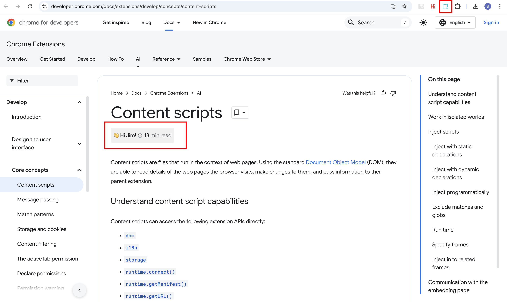

# Learning Chrome Extension

My notes, examples, and experiments with Chrome Extension. The tutorial is [here](https://developer.chrome.com/docs/extensions/get-started).

## Extensions

- [hello_world](./hello_world/)
- [reading_time](./reading_time/)

## Reading Time (2024/11/22)

> https://developer.chrome.com/docs/extensions/get-started/tutorial/scripts-on-every-tab

- declare the content script:

```json
"content_scripts": [
  {
    "js": ["scripts/content.js"],
    "matches": [
      "https://developer.chrome.com/docs/extensions/*",
      "https://developer.chrome.com/docs/webstore/*"
    ]
  }
]
```

| Off                            | ON                           |
| ------------------------------ | ---------------------------- |
|  |  |

## Hello World (2024/11/12)

> https://developer.chrome.com/docs/extensions/get-started/tutorial/hello-world

- `mainifest.json` is like `package.json` in Node project, which describes the extension's capabilities and configurations.
- A popup has its own DevTools.
